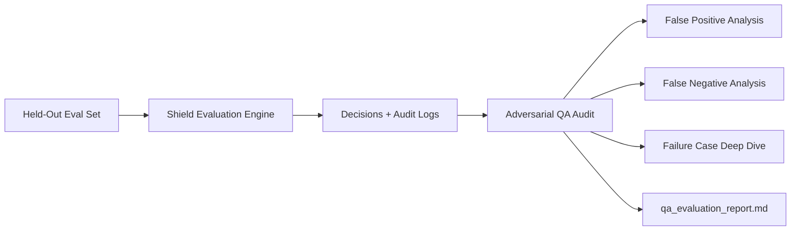

# Adversarial QA & Failure Mode Evaluation

Specialized guide for rigorously evaluating the Shield's decision accuracy, auditing explainability trails, and analyzing known failure modes without overfitting.

## Core Responsibilities
1. **Held-Out Evaluation Execution**: Replay `_workspace/dataset/heldout_eval_transactions.json` through the integrated Shield.
2. **False Positive & Negative Diagnostics**:
   - Inspect tricky legitimate cases to identify unnecessary merchant friction.
   - Inspect adversarial bypasses to detect pattern evasion.
3. **Audit Trail Verification**: Verify that every transaction produces an unambiguous, human-readable rationale.
4. **Honest Failure Case Analysis**: Deeply analyze and document the known failure case (required for Track 02).

---

## QA Evaluation Protocol

---

## 1. Boundary & False Positive Auditing
Inspect legitimate test cases that sit near risk boundaries:
- **Bulk Purchasing**: An agent buying 50 units of standard stationery for a business.
  - *Risk*: Velocity or Intent check mistakenly flags high quantity as an anomaly.
  - *Expected Resolution*: Intent matches stated enterprise context; Shield allows with normal logging.
- **Near-Threshold Budget**: Cart total at 99.5% of max budget constraint.
  - *Risk*: Heuristic math floating point or loose ceiling triggers false flag.
  - *Expected Resolution*: Strictly within bounds $\rightarrow$ `ALLOW`.

---

## 2. Failure Case Documentation (`failure_case_analysis.md`)

The buildathon requires an honest, gracefully handled failure case to demonstrate transparent risk awareness:

### Standard Known Failure Case Format
- **Scenario ID**: `tx_synth_fail_001`
- **Attack Vector**: Subtly paraphrased multi-step intent drift (Semantic Paraphrasing / Synonym Drift).
- **Observed Decision**: `ALLOW` (False Negative) or `FLAG` with low confidence.
- **Root Cause**: Deterministic keyword matching missed nuanced synonymy without a full semantic LLM-judge pass, while the LLM judge evaluated it as borderline.
- **Production Trade-off**: Explain why solving this requires higher LLM inference latency/cost, justifying why a fast pattern heuristic was preferred for the 2-day prototype.

---

## 3. Audit Quality Checklist
For every decision in `_workspace/audit_logs/`:
- [ ] Contains `audit_id`, `timestamp`, and `transaction_id`.
- [ ] Contains explicit `decision` (`ALLOW`, `FLAG`, or `BLOCK`).
- [ ] Contains plain-English `reason` understandable by a merchant operator.
- [ ] Enumerates all `triggered_checks`.
- [ ] Does not leak sensitive system prompts or raw internal stack traces.
