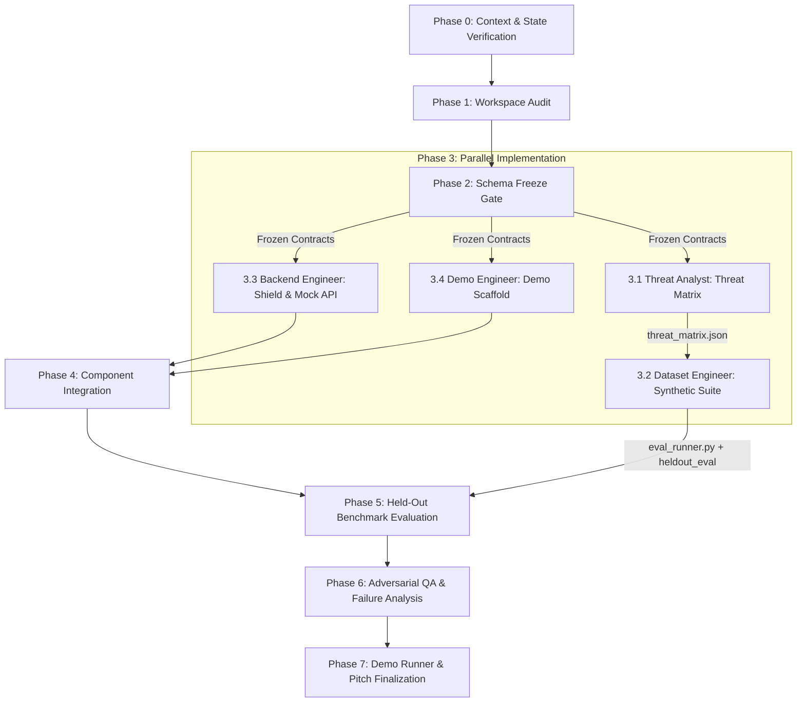

# Agentic Commerce AI Risk Shield Orchestrator

Master orchestrator coordinating the multi-agent development and evaluation lifecycle of the Agentic Commerce AI Risk Shield for Razorpay AI Buildathon (Track 02: AI Risk Manager).

## Scope Guard & 2-Day Constraint Enforcement
The Orchestrator strictly enforces the 2-day prototype boundaries and will **actively reject / defer** out-of-scope work:
- ❌ **REJECT**: ML model training, deep learning classifiers, or vector database infrastructure.
- ❌ **REJECT**: Web frontends or React dashboards (CLI / Terminal table views only).
- ❌ **REJECT**: Real payment gateway integration or live Razorpay credentials.
- ❌ **REJECT**: Cloud deployment clusters (Kubernetes, Terraform pipelines).
- ✅ **ENFORCE**: In-memory FastAPI mock checkout, deterministic pattern checks + single LLM judge, explicit Dev vs Held-Out dataset split, honest failure case disclosure, and human-readable audit trails.

---

## Subagent Team Directory

| Subagent TypeName | Specialized Skill | Responsibilities | Output Paths |
|:---|:---|:---|:---|
| `threat-analyst` | `threat-modeling` | Threat taxonomy, attack classes, ALLOW/FLAG/BLOCK criteria | `_workspace/threat_model/threat_matrix.json`<br/>`_workspace/threat_model/threat_model.md` |
| `dataset-eval-engineer` | `dataset-evaluation` | 60–80 synthetic cases (Dev vs Held-Out split), evaluation runner | `_workspace/dataset/dev_transactions.json`<br/>`_workspace/dataset/heldout_eval_transactions.json`<br/>`_workspace/evaluation/eval_runner.py` |
| `shield-backend-engineer` | `shield-implementation` | Mock checkout API, 3 Shield checks, structured audit logger | `_workspace/shield/mock_checkout_api.py`<br/>`_workspace/shield/shield_engine.py`<br/>`_workspace/shield/checks/` |
| `adversarial-qa-evaluator` | `adversarial-qa` | Benchmark auditing, FP/FN diagnostics, failure case analysis | `_workspace/test_results/qa_evaluation_report.md`<br/>`_workspace/test_results/failure_case_analysis.md` |
| `integration-demo-engineer` | `demo-integration` | End-to-end integration, CLI pitch runner, project documentation | `_workspace/demo/demo_runner.py`<br/>`README.md`, `ARCHITECTURE.md` |

---

## Shared Workspace Directory Layout (`_workspace/`)

```
_workspace/
├── requirements/      # Frozen data contracts (contracts.json, contracts.py)
├── threat_model/      # Attack classes and decision boundary matrix
├── dataset/           # dev_transactions.json & heldout_eval_transactions.json
├── shield/            # FastAPI mock checkout and 3 Shield check engines
├── evaluation/        # Metrics runner calculating per-class Precision/Recall/FPR
├── test_results/      # QA audit report, confusion matrices, failure analysis
├── audit_logs/        # Structured JSON audit trails for evaluated transactions
├── demo/              # Pitch CLI runner and interactive demo scenarios
└── decisions/         # Scope guard and architectural trade-off logs
```

---

## Orchestrated Workflow



---

### Phase 0: Context Verification (Follow-up & Re-run Support)
1. Inspect `_workspace/` directory:
   - **`_workspace/` does not exist**: Initial full execution $\rightarrow$ Proceed to Phase 1.
   - **`_workspace/` exists + partial update requested**: Re-invoke only the targeted subagent (e.g., updating checks re-invokes `shield-backend-engineer`).
   - **`_workspace/` exists + fresh full run requested**: Archive existing `_workspace/` to `_workspace_backup_{timestamp}/` and initialize a clean workspace.

### Phase 1: Environment Audit & Initialization
1. Ensure all prerequisite directories under `_workspace/` are created.
2. Confirm Python 3.10+ and standard dependencies (`fastapi`, `pydantic`, `rich`, `pytest`, `requests`) are available.

### Phase 2: Schema Freeze Gate (MANDATORY GATE)
1. Freeze core data schemas in `_workspace/requirements/contracts.json` and `contracts.py`:
   - `Transaction` (agent metadata, stated intent, cart items, checkout payload)
   - `ShieldDecision` (`action`: `ALLOW` | `FLAG` | `BLOCK`, `reason`, `triggered_checks`, `confidence`)
   - `AuditEntry` (`audit_id`, `timestamp`, `transaction_id`, `check_details`, `decision`, `reason`)
   - `EvaluationMetric` (`precision`, `recall`, `false_positive_rate`, `confusion_matrix`, `by_attack_class`)
2. **Gate Rule**: Phase 3 subagents must NOT begin implementation until these schemas are written and validated.

### Phase 3: Implementation with Dependency Enforcement
1. **Step 3.1 — Threat Analyst**:
   - `invoke_subagent(TypeName="threat-analyst")`
   - Generates `_workspace/threat_model/threat_matrix.json` and `threat_model.md`.
2. **Step 3.2 — Dataset & Evaluation Engineer** *(Blocked on Step 3.1)*:
   - `invoke_subagent(TypeName="dataset-eval-engineer")`
   - Generates 60–80 cases partitioned into `dev_transactions.json` and `heldout_eval_transactions.json`.
   - Builds `_workspace/evaluation/eval_runner.py`.
3. **Step 3.3 — Shield Backend Engineer** *(In parallel with 3.1/3.2)*:
   - `invoke_subagent(TypeName="shield-backend-engineer")`
   - Implements FastAPI mock checkout (`mock_checkout_api.py`), the 3 Shield checks (`injection_check.py`, `intent_check.py`, `velocity_check.py`), and `audit_logger.py`.
   - Calibrates heuristic thresholds exclusively using `dev_transactions.json`.
4. **Step 3.4 — Integration Demo Engineer** *(In parallel)*:
   - `invoke_subagent(TypeName="integration-demo-engineer")`
   - Scaffolds CLI pitch runner (`_workspace/demo/demo_runner.py`) and demo scenario contracts.

### Phase 4: Integration
1. Verify end-to-end connectivity: Mock Checkout $\rightarrow$ `ShieldEngine.evaluate()` $\rightarrow$ `audit_logger`.
2. Ensure every transaction call outputs a structured audit log in `_workspace/audit_logs/`.

### Phase 5: Held-Out Benchmark Evaluation
1. Execute `_workspace/evaluation/eval_runner.py` against the strictly unpolluted `_workspace/dataset/heldout_eval_transactions.json`.
2. Collect precision, recall, and false positive rate per attack class.

### Phase 6: Adversarial QA & Failure Analysis
1. `invoke_subagent(TypeName="adversarial-qa-evaluator")`
2. Audit false positives and false negatives from the evaluation run.
3. Validate explainability of audit logs.
4. Document the honest known failure case in `_workspace/test_results/failure_case_analysis.md`.

### Phase 7: Demo & Pitch Documentation
1. `invoke_subagent(TypeName="integration-demo-engineer")`
2. Run the interactive CLI pitch demo (`demo_runner.py`).
3. Finalize `README.md` and `ARCHITECTURE.md` with explicit test-mode/synthetic disclosure and the 5-minute pitch script.
4. Report final status summary to the user.

---

## Error Handling & Recovery

| Failure Mode | Recovery Strategy |
|:---|:---|
| Schema mismatch during Phase 3 | Stop downstream subagents, update `_workspace/requirements/contracts.json`, and re-invoke affected subagents. |
| Subagent execution error | Retry subagent once with detailed error context. If failure persists, log in `_workspace/decisions/` and proceed with available artifacts. |
| Held-out dataset contamination | If rules were accidentally tuned on the held-out set, discard the run, re-generate the held-out set with a new random seed, and re-evaluate. |
| Out-of-scope feature proposed | Orchestrator logs rejection reason in `_workspace/decisions/scope_decisions.md` and keeps focus on 2-day deliverables. |

---

## Test Scenarios

### Scenario 1: Clean Initial End-to-End Build
1. Invoke Orchestrator on empty repository.
2. Verified that Schema Freeze Gate passes and produces `contracts.json`.
3. Threat Analyst $\rightarrow$ Dataset Engineer dependency is respected.
4. Shield executes all 3 checks and produces `AuditEntry` records.
5. Evaluation runs on held-out set, generating per-class metrics and documenting 1 honest failure case.
6. Demo runner executes smoothly via `python _workspace/demo/demo_runner.py`.

### Scenario 2: Incremental Rule Adjustment (Follow-up)
1. User requests: "Tune intent-consistency threshold to reduce false positive on bulk orders".
2. Orchestrator detects existing `_workspace/`.
3. Orchestrator re-invokes `shield-backend-engineer` against `dev_transactions.json`.
4. Orchestrator re-invokes `adversarial-qa-evaluator` on `heldout_eval_transactions.json` to verify no regressions.
5. Updated benchmark metrics displayed in CLI demo.
