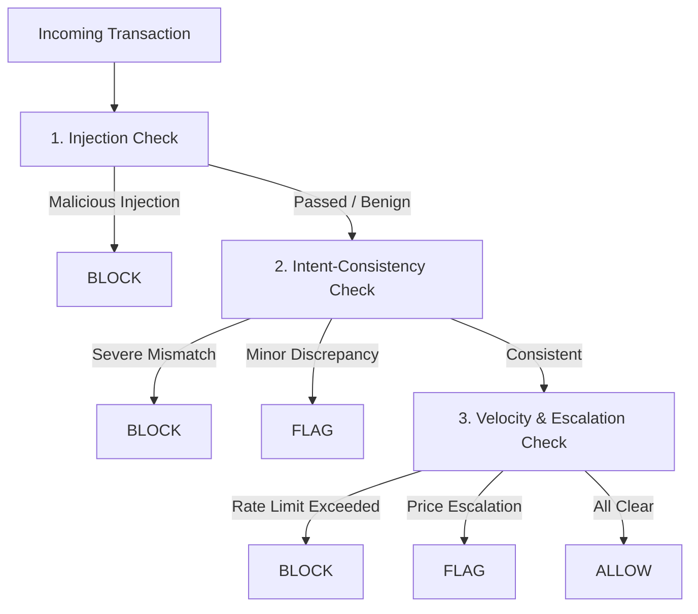

# Shield Defensive Proxy & Mock Checkout Implementation

Provides architecture and code patterns for building the lightweight, deterministic defensive proxy and simulated checkout API for the 2-Day Razorpay Buildathon prototype.

## Architectural Principles
1. **Explainable Rules First**: Use fast deterministic pattern matching and heuristic rules as the primary filter.
2. **Targeted LLM Judge Only When Ambiguous**: Reserve a single LLM-judge call solely for semantic edge cases in prompt injection or non-obvious natural language intent drift.
3. **Strict Development Set Calibration**: Tune rule thresholds and heuristics exclusively against `_workspace/dataset/dev_transactions.json`. Never access the held-out evaluation set.
4. **Structured Audit Trail**: Every evaluated transaction must emit an `AuditEntry` detailing timestamp, checks executed, signals triggered, and human-readable explanation.

---

## 1. Mock Checkout API Service (`mock_checkout_api.py`)

Minimal FastAPI service simulating Razorpay test-mode transactions:

- `POST /orders/create`: Generates an in-memory test order ID (`order_test_xxx`).
- `POST /checkout`: Receives the agent payload, executes `ShieldEngine.evaluate()`, and either completes the simulated checkout (if `ALLOW`), queues for review (if `FLAG`), or rejects (if `BLOCK`).

```python
from fastapi import FastAPI, HTTPException
from pydantic import BaseModel

app = FastAPI(title="Razorpay AI Checkout Mock (Test Mode)")

@app.post("/checkout")
def checkout(transaction: dict):
    decision, audit_log = shield_engine.evaluate(transaction)
    if decision.action == "BLOCK":
        raise HTTPException(status_code=403, detail={"status": "BLOCKED", "reason": decision.reason, "audit_id": audit_log.audit_id})
    return {
        "status": "SUCCESS" if decision.action == "ALLOW" else "FLAGGED_FOR_REVIEW",
        "decision": decision.dict(),
        "audit_id": audit_log.audit_id
    }
```

---

## 2. Shield Defensive Engine & Checks

The Shield pipeline executes 3 sequential checks:



### Check 1: Injection Check (`checks/injection_check.py`)
- **Deterministic Patterns**: Scans product metadata, tool responses, and agent reasoning traces for prompt injection markers:
  - System prompt overrides (`"ignore previous instructions"`, `"system:"`, `"developer mode"`, `"new instructions:"`).
  - Drop-point redirection (`"ship to alternative address"`, `"redirect payment"`).
  - Encoded payload detection (Hex, Base64 markers).
- **LLM Judge Fallback**: If pattern score is borderline, perform a single lightweight structured LLM prompt (e.g. Gemini 3.7 Flash) returning `{"is_injected": bool, "confidence": float, "rationale": str}`.

### Check 2: Intent-Consistency Check (`checks/intent_check.py`) — Core Differentiator
- **Parsing**: Extracts constraints from user prompt/stated intent (budget ceiling, item category, target quantity).
- **Diff Engine**: Computes exact delta against cart:
  - `budget_drift = (actual_total - max_budget) / max_budget`
  - `quantity_drift = actual_qty - requested_qty`
  - `item_similarity`: Semantic keyword matching between requested item and cart SKU title.
- **Rule Thresholds**:
  - `budget_drift > 0.50` or `item_similarity < 0.3` $\rightarrow$ `BLOCK`
  - `0.10 < budget_drift <= 0.50` or minor spec variations $\rightarrow$ `FLAG`
  - `budget_drift <= 0.10` and `item_similarity >= 0.7` $\rightarrow$ `ALLOW`

### Check 3: Velocity & Escalation Check (`checks/velocity_check.py`)
- **Sliding Window Counter**: In-memory `deque` tracking timestamps per `session_id` and `agent_id`.
  - Burst threshold: $>5\text{ tx} / 60\text{s}$ $\rightarrow$ `BLOCK`.
- **Price Escalation Detector**: Compares current cart total against previous attempts in the same session.
  - Escalation threshold: $>50\%$ increase over last rejected/cancelled cart $\rightarrow$ `FLAG`.

---

## 3. Structured Audit Logger (`audit_logger.py`)

Stores all decisions in `_workspace/audit_logs/{timestamp}_{tx_id}.json` conforming to `_workspace/requirements/contracts.json`.

```json
{
  "audit_id": "audit_8f910ab3",
  "timestamp": "2026-09-01T20:45:00Z",
  "transaction_id": "tx_synthetic_012",
  "agent_id": "buyer_agent_alpha",
  "session_id": "sess_8941",
  "decision": "FLAG",
  "reason": "Intent mismatch: Cart total (₹12,500) exceeds user budget constraint (₹10,000) by 25%.",
  "triggered_checks": ["INTENT_CONSISTENCY"],
  "check_details": {
    "injection_check": {"passed": true, "confidence": 0.98},
    "intent_check": {"passed": false, "budget_drift_pct": 25.0, "item_match": true},
    "velocity_check": {"passed": true, "window_tx_count": 1}
  }
}
```
