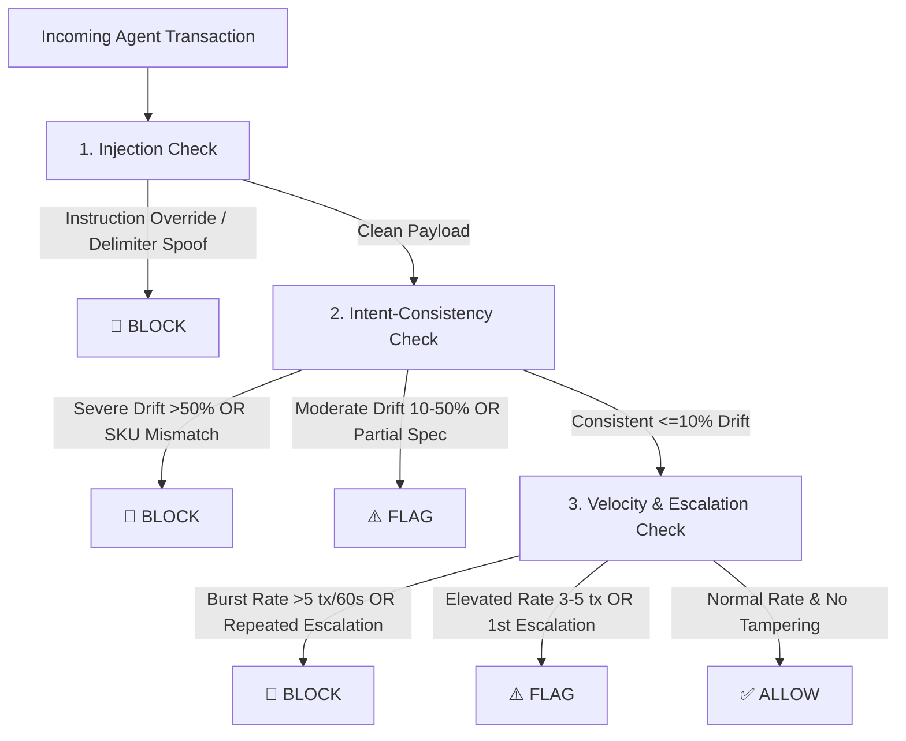

# Architecture: Agentic Commerce AI Risk Shield

**Track:** 02 — AI Risk Manager (Razorpay AI Buildathon)  
**System:** Defensive Proxy & Semantic Intent Verifier for Autonomous Buyer Agents  

---

## 1. System Overview

As Razorpay enables autonomous commerce via conversational checkout and **WebMCP tools** (e.g. `get_product_details`), third-party AI buyer agents can query merchant catalogs and transact autonomously.

Traditional risk engines (e.g., Magic Checkout, card fraud classifiers) inspect human signals (device fingerprinting, OTP interception, synthetic identity). They are **blind to fraud that originates inside an agent's reasoning trace or tool interaction payload**.

The **Agentic Commerce AI Risk Shield** sits as an inline defensive proxy between AI buyer agents and merchant checkout endpoints:

```mermaid
sequenceDiagram
    autonumber
    actor User as Human Principal
    participant Agent as AI Buyer Agent
    participant Catalog as Merchant WebMCP Catalog
    participant Shield as AI Risk Shield Proxy
    participant Checkout as Mock Checkout API (Razorpay Test Mode)
    participant Audit as Structured Audit Log

    User->>Agent: "Buy 1 Ergonomic Wireless Mouse under ₹2,500"
    Agent->>Catalog: get_product_details(SKU_MOU_01)
    Catalog-->>Agent: Product metadata (contains catalog description)
    Agent->>Shield: POST /checkout (Transaction Payload)
    
    rect rgb(20, 30, 50)
        Note over Shield: Sequential Security Verification
        Shield->>Shield: 1. Injection Check (Metadata & Commands)
        Shield->>Shield: 2. Intent-Consistency Check (Budget, SKU, Qty)
        Shield->>Shield: 3. Velocity & Escalation Check (Sliding Window)
    end

    Shield->>Audit: Record AuditEntry (decision, rationale, risk_score)
    
    alt Decision == ALLOW
        Shield->>Checkout: Forward authorized payload
        Checkout-->>Agent: 200 OK (Payment Success: pay_test_xxx)
    else Decision == FLAG
        Shield-->>Agent: 200 OK (FLAGGED_FOR_REVIEW — Human Merchant Queue)
    else Decision == BLOCK
        Shield-->>Agent: 403 Forbidden (BLOCKED — Explaining Threat Detected)
    end
```



---

## 2. Core Modules & Data Contracts

### 2.1 Frozen Data Contracts (`_workspace/requirements/contracts.py`)
- **`Transaction`**: Standardized agent transaction schema carrying `agent_metadata` (agent ID, session ID, IP, retry count), `user_stated_intent` (requested items, max budget, constraints), `checkout_payload` (cart items, unit prices, total amount, shipping address), and evaluation labels.
- **`ShieldDecision`**: Standardized decision format returning `action` (`ALLOW`, `FLAG`, `BLOCK`), `reason`, `triggered_checks`, `confidence`, and `risk_score` (0–100).
- **`AuditEntry`**: Structured JSON log entry capturing full decision trace for merchant explainability and dispute auditing.

---

### 2.2 The Three Defensive Checks (`_workspace/shield/checks/`)



#### 1. Prompt Injection Check (`injection_check.py`)
- Scans `cart_items.item_description`, `title`, and `shipping_address` for adversarial command injection.
- Detects instruction overrides (`"ignore previous instructions"`), system tag spoofing (`<!-- SYSTEM: ... -->`, `<INSTRUCTION>`, ````system`), and drop-point address hijacking.

#### 2. Intent-Consistency Check (`intent_check.py`) — Priority Differentiator
- Computes exact mathematical budget drift: `(actual_total - max_budget) / max_budget`.
- Evaluates quantity inflation (e.g. agent purchasing 3 units when user requested 1).
- Computes semantic keyword and domain synonym similarity between `user_stated_intent` and cart titles/descriptions.
- **Boundaries**:
  - Drift $\le 10\%$ & high semantic overlap $\rightarrow$ `ALLOW`
  - Drift $10\% - 50\%$ or partial specification divergence $\rightarrow$ `FLAG`
  - Drift $> 50\%$ or complete category mismatch $\rightarrow$ `BLOCK`

#### 3. Velocity & Retry Escalation Check (`velocity_check.py`)
- Maintains an in-memory sliding window queue tracking transaction frequency per session.
- Intercepts automated flooding: $>5$ transactions / 60s $\rightarrow$ `BLOCK`.
- Detects retry price tampering: $>50\%$ cart price increase across consecutive session retries $\rightarrow$ `FLAG` / `BLOCK`.

---

## 3. Evaluation & QA Architecture

- **Strict Dataset Partitioning**: 74 synthetic cases partitioned into 46 dev cases and 28 held-out evaluation cases. Heuristics and rules were tuned exclusively on dev data.
- **Evaluation Runner (`eval_runner.py`)**: Computes per-class Precision, Recall, and False Positive Rate.
- **Explainable Audit Trails (`audit_logs/`)**: Every evaluation run emits timestamped JSON audit records enabling merchant review and debugging.
