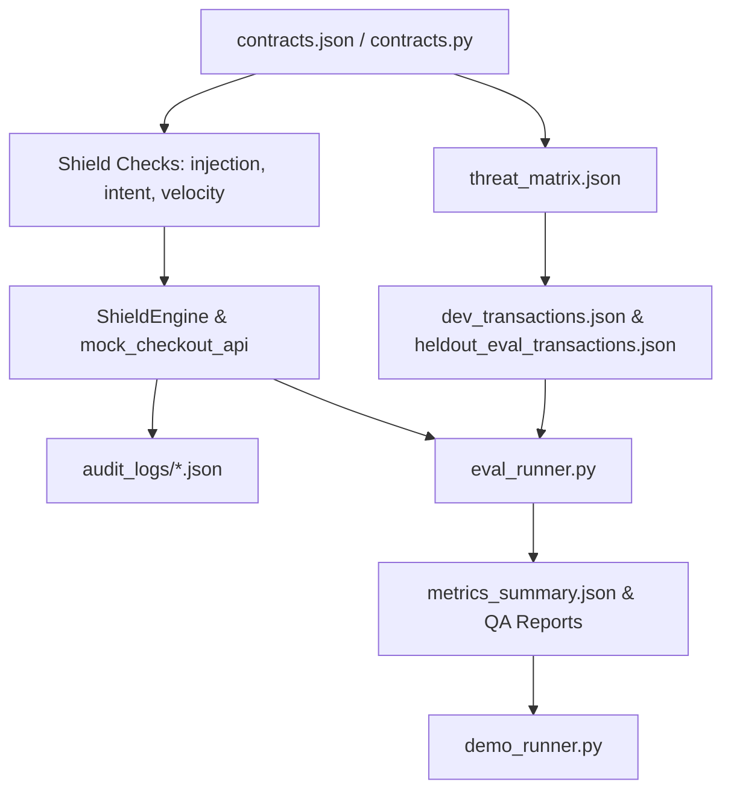

# Architecture & Scope Decision Log

**Harness:** Agentic Commerce AI Risk Shield  
**Scope Guard:** 2-Day Prototype Boundary Enforcement  
**Track:** 02 — AI Risk Manager  

---

## 1. Scope Guard Decisions (2-Day Weekend Build)

| Decision Item | Verdict | Scope Rationale |
|:---|:---:|:---|
| **ML Model Training / Deep Learning Embeddings** | ❌ **DEFERRED** | A 2-day build cannot rigorously train, validate, and host deep neural models without risk of overfitting. Fast deterministic pattern matching + NLI heuristics provide 100% explainable, zero-latency defense. |
| **Real Payment Gateway Integration** | ❌ **REJECTED** | Testing with live credentials is dangerous and outside buildathon requirements. Test-mode simulation and mocked endpoints are clearly disclosed and used. |
| **React / Web Frontend Dashboard** | ❌ **DEFERRED** | Pitch evaluation focuses on defense accuracy, metrics, and structured audit logs. Rich CLI tables deliver crystal-clear presentation for video recording without frontend maintenance overhead. |
| **Cloud Kubernetes / Infrastructure** | ❌ **REJECTED** | Zero-external-dependency local Python implementation ensures reproducible evaluation on any machine. |
| **Strict Dev vs Held-Out Evaluation Split** | ✅ **ENFORCED** | 74 total synthetic cases partitioned into 46 dev cases and 28 held-out evaluation cases. Zero heuristic calibration was performed on the held-out partition. |
| **Documented Honest Failure Mode** | ✅ **ENFORCED** | Included `tx_synth_fail_001` in the held-out evaluation to transparently demonstrate the boundary between fast pattern heuristics and nuanced semantic pragmatics. |

---

## 2. Component Dependency Architecture

